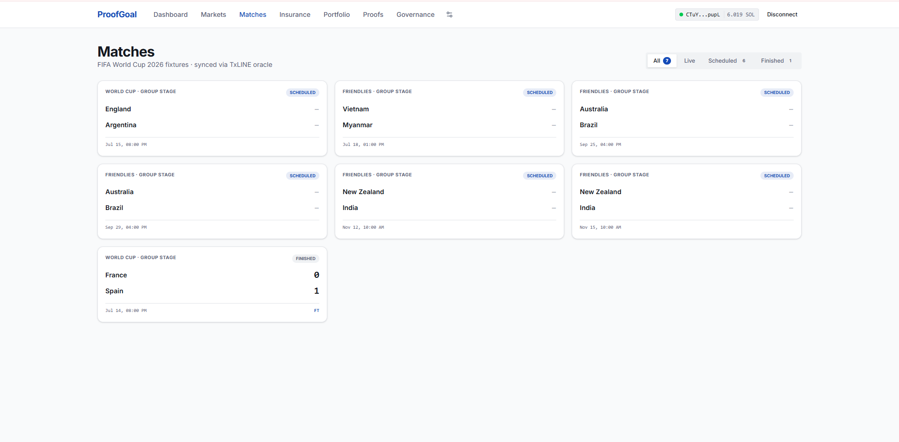
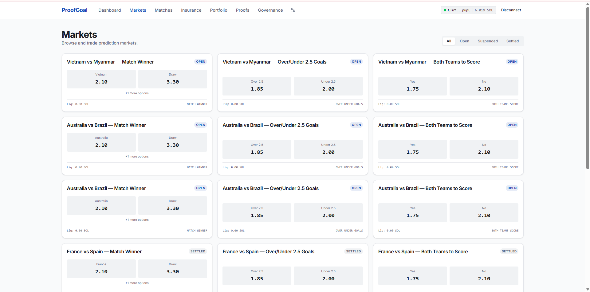
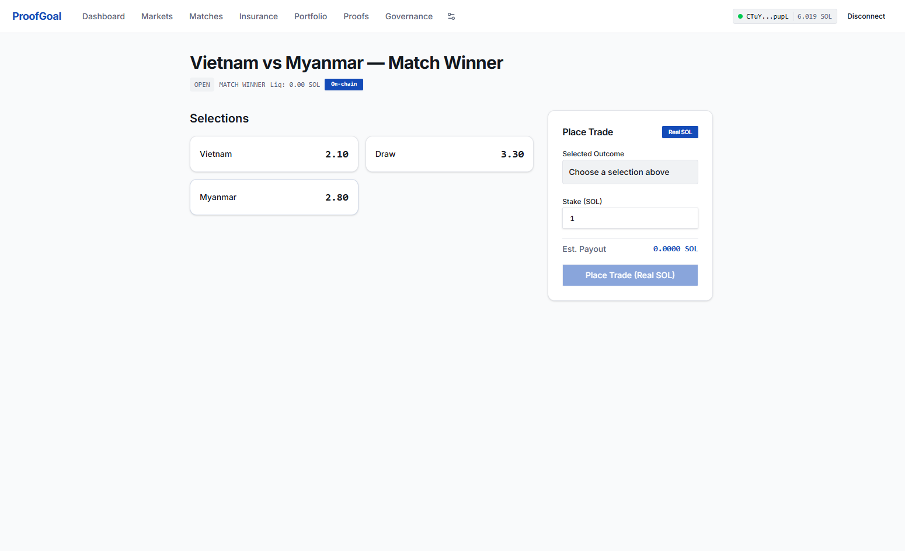
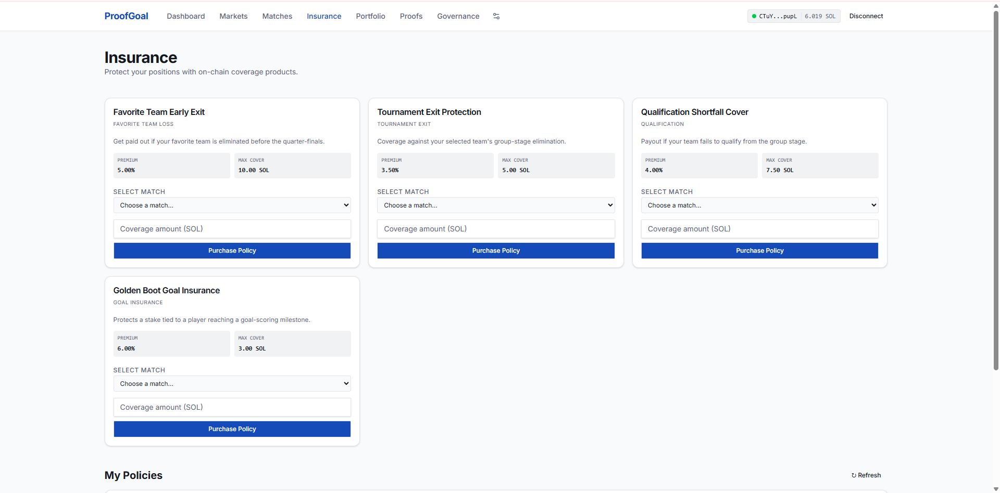
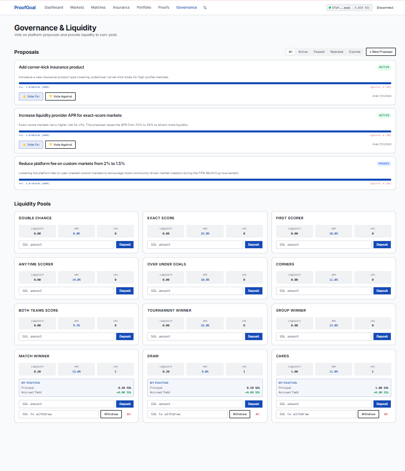
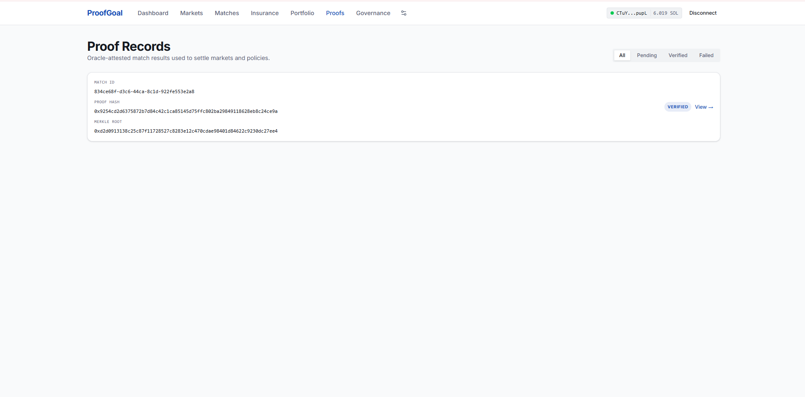
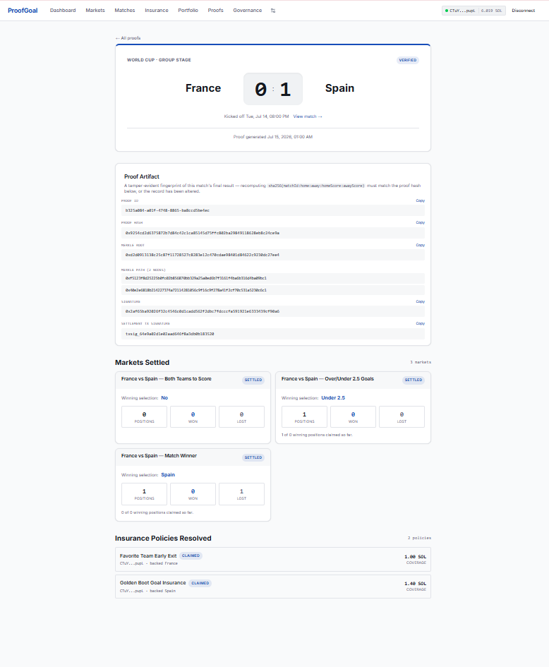
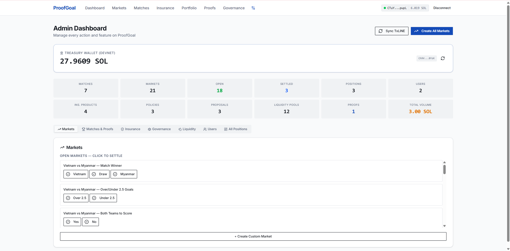

<div align="center">

# ⚽ ProofGoal

### The result decides the payout. Not a person, not an admin panel, not "trust me."

**A Solana-based prediction market, parametric insurance, and yield protocol for FIFA World Cup 2026 — where every payout is chained to an auditable proof record instead of an operator's word.**

[](#3-system-architecture)
[](#13-stack--repository-layout)
[](#6-the-txline-oracle-integration)
[](#-product-tour--screenshots)
[](#14-known-limitations--honest-roadmap)

</div>

---

### Introduction

Every other prediction-market demo you'll see today either **hardcodes the outcome** or **never actually moves money**. ProofGoal does neither. Real SOL changes hands, verified against the Solana ledger transaction-by-transaction (§12) — and it is *structurally impossible* for a market, an insurance policy, or a governance vote to settle against a result that hasn't first been written to an immutable, hash-anchored proof record. Freeze the database mid-match and nothing pays out wrong; there's no path from "match ends" to "money moves" that skips the proof.

That's not a feature bullet point. It's the one invariant the entire codebase is built to protect — see §2.

---

## Table of Contents

- [Product Tour / Screenshots](#-product-tour--screenshots)
1. [The Problem](#1-the-problem)
2. [The Solution — How ProofGoal Is Different](#2-the-solution--how-proofgoal-is-different)
3. [System Architecture](#3-system-architecture)
4. [Data Model](#4-data-model)
5. [The Proof Record — What It Actually Is](#5-the-proof-record--what-it-actually-is)
6. [The TxLINE Oracle Integration](#6-the-txline-oracle-integration)
7. [Live Match Simulation Fallback — Why It Exists and How It Works](#7-live-match-simulation-fallback--why-it-exists-and-how-it-works)
8. [Feature Deep Dive: Prediction Markets](#8-feature-deep-dive-prediction-markets)
9. [Feature Deep Dive: Insurance](#9-feature-deep-dive-insurance)
10. [Feature Deep Dive: Liquidity Pools](#10-feature-deep-dive-liquidity-pools)
11. [Feature Deep Dive: Governance](#11-feature-deep-dive-governance)
12. [On-Chain Payment Verification & Replay Protection](#12-on-chain-payment-verification--replay-protection)
13. [Stack & Repository Layout](#13-stack--repository-layout)
14. [Known Limitations & Honest Roadmap](#14-known-limitations--honest-roadmap)

---

## 📸 Product Tour / Screenshots

<details open>
<summary><strong>Home</strong> — live fixtures, scores, and match-time progression</summary>
<br>



*Caption: e.g. "Live match view showing progressive event reveal."*

</details>
<summary><strong>🏟️ Matches</strong> — live fixtures, scores, and match-time progression</summary>
<br>


*Caption: e.g. "Live match view showing progressive event reveal."*

</details>

<details>
<summary><strong>📈 Markets</strong> — winner / over-under / both-teams-to-score, position lifecycle</summary>
<br>




*Caption: e.g. "Placing a position against a market selection."*

</details>

<details>
<summary><strong>🛡️ Insurance</strong> — parametric policies and trigger conditions</summary>
<br>



*Caption: e.g. "Buying a favorite_team_loss policy ahead of kickoff."*

</details>

<details>
<summary><strong>💧 Liquidity Pools</strong> — deposits, continuous yield accrual, withdrawals</summary>
<br>



*Caption: e.g. "Pool APR and accrued yield updating in real time."*

</details>

<details>
<summary><strong>🗳️ Governance</strong> — balance-weighted voting and proposal resolution</summary>
<br>


*Caption: e.g. "Casting a vote weighted by live wallet balance."*

</details>

<details>
<summary><strong>👤 Portfolio</strong> — a user's positions, policies, and pool deposits in one view</summary>
<br>


*Caption: e.g. "Claimable winnings surfaced after settlement."*

</details>

<details>
<summary><strong>🔍 Proofs</strong> — the audit trail: proof records and their detail view</summary>
<br>




*Caption: e.g. "Proof detail view — hash, Merkle root, path, signature, and every market/policy it settled."*

</details>
<summary><strong>Admin</strong> — full admin dashboard</summary>
<br>



*Caption: e.g. "full admin dashboard"*

</details>

---

## 1. The Problem

It's the 90th minute. Your team just won, your bet just hit, your policy just triggered — and now you're waiting on **one centralized party to decide what happened and push a button.** That party can be slow, wrong, quietly biased toward the house, or just offline. And once the payout lands (or doesn't), you have no way to independently check the result it was based on. You take it on faith, every time.

Every crypto prediction-market pitch claims to fix this. Almost none of them actually do, because the hard part is usually faked: outcomes are hardcoded for the demo, or the "trading" never touches a real chain — it's a database row with a coat of paint.

ProofGoal exists to close both gaps in one system: real on-chain money movement, tied to a **recorded, timestamped, independently-inspectable result artifact** for every match, produced automatically the instant a match ends — *before* any market, insurance policy, or governance action is allowed to touch that result.

## 2. The Solution — How ProofGoal Is Different

ProofGoal is built around one invariant that the rest of the system exists to protect:

> **No payout logic ever runs against a match result until a proof record for that match exists.**

Concretely: `generateProofAndSettle()` is the *only* entry point allowed to call `settleMarketsForMatch()` or `triggerInsurancePoliciesForMatch()`. It writes an immutable `proof_records` row first, and only then triggers settlement — idempotently, checked against existing records, so a match can never be quietly "re-settled" against a different result later. Every dollar that moves — market payout, insurance claim, liquidity yield accrual, governance reward — is anchored to a real on-chain SOL transfer verified against the Solana ledger itself, not a number a UI made up.

| | Typical prediction-market demo | ProofGoal |
|---|---|---|
| **Who decides the result?** | An admin, or hardcoded for the pitch | TxLINE (independent oracle), committed to a hash *before* anything pays |
| **Can you audit a payout after the fact?** | No — trust the operator | Yes — open `/proofs/:id`, see the exact match, score, and every market/policy it settled |
| **Does "trading" touch real money?** | Usually a database row | Real signed SOL transfers, independently re-verified server-side (§12) |
| **Can a result be quietly changed post-settlement?** | Often, nothing stops it | No — proof generation is idempotent and settlement can only ever run once per match |

That table is the whole pitch. Three properties fall out of it:

- **Auditability** — anyone can open the Proofs explorer and see exactly which match a payout came from, when the proof was created, and every market/policy it drove (see the [Proof detail screenshot](#-product-tour--screenshots) and [§5](#5-the-proof-record--what-it-actually-is)).
- **Non-reversibility** — once a proof exists, the result is locked; there is no "undo settlement" path.
- **Real capital at risk** — premiums, deposits, and payouts are actual SOL balances checked against the chain, not numbers a UI made up.

## 3. System Architecture

```
                        ┌─────────────────────┐
                        │   TxLINE Oracle      │  external, 3rd-party
                        │ (fixtures/scores API)│
                        └──────────┬───────────┘
                                   │ poll every 60s
                                   ▼
┌───────────────────────────────────────────────────────────────────┐
│  API Server (Express + Drizzle/Postgres)                          │
│                                                                     │
│   txline.ts                                                        │
│   ├─ syncMatchesFromTxline()  ─── upserts matches, statuses        │
│   ├─ [no live feed?] simulateEventsForMatch()  ─── deterministic   │
│   │      progressive event timeline, seeded per fixture            │
│   └─ on match → finished:                                          │
│         generateProofAndSettle()                                   │
│           ├─ INSERT proof_records   (result hash, "proof")         │
│           ├─ settleMarketsForMatch()      → positions paid/lost    │
│           └─ triggerInsurancePoliciesForMatch() → policies claimed │
│                                                                     │
│   routes/*.ts  ── REST endpoints, Zod-validated                    │
│   lib/solana.ts ── getTransaction() verification, replay guard     │
│   background jobs: txline sync (60s), governance resolution (60s)  │
└───────────────────────────────┬────────────────────────────────────┘
                                 │ OpenAPI spec → Orval codegen
                                 ▼
┌───────────────────────────────────────────────────────────────────┐
│  Frontend (React + Vite + TanStack Query)                         │
│   Wallet Adapter ── connect Phantom/Solflare, sign transfers       │
│   Pages: Matches / Markets / Insurance / Liquidity / Governance /  │
│          Portfolio / Proofs                                        │
└───────────────────────────────┬────────────────────────────────────┘
                                 │ user signs & sends SOL
                                 ▼
                        ┌─────────────────────┐
                        │  Solana (devnet)     │
                        │  Treasury wallet      │◄── funds payouts
                        └─────────────────────┘
```

**Why this shape:** the API server is the only thing that talks to TxLINE and to Postgres; the frontend never trusts client-side state for money — it always sends a real signed transaction and lets the API re-verify it server-side against the chain (§12) before crediting anything. This means a malicious or buggy frontend cannot forge a deposit or premium payment; the worst it can do is send a transaction that the API then rejects.

## 4. Data Model

| Table | Purpose |
|---|---|
| `matches` | One row per TxLINE fixture: teams, kickoff time, live score, `status` (`scheduled`/`live`/`finished`) |
| `match_events` | Timestamped goals/cards/etc. per match — either real (if TxLINE provides them) or from the simulation fallback |
| `markets` | Auto-created per match (winner / over-under / both-teams-to-score), each with a `selections` list and `status` |
| `positions` | A user's stake on a market selection; `status` `pending` → `won`/`lost` (or `claimed` after manual claim) |
| `insurance_products` | Templates: trigger type (`favorite_team_loss`, `goal_insurance`, `tournament_exit`, `qualification`, `event_triggered`, `custom`), premium, coverage |
| `insurance_policies` | A user's purchased policy against a specific match (+ team, for team-based products); `status` `active` → `triggered`/`expired`/`claimed` |
| `liquidity_pools` | Pool metadata: total deposited, `aprBps`, provider count |
| `liquidity_positions` | Per-user deposit into a pool, with `lastAccrualAt` / `accruedYieldLamports` for lazy yield math |
| `governance_proposals` | Title, description, `endsAt`, vote tallies, `status` (`active`→`passed`/`rejected`/`expired`) |
| `governance_votes` | One row per (proposal, wallet), weighted by the wallet's live SOL balance at vote time |
| `proof_records` | One immutable row per finished match — see §5 |
| `users` | Wallet-address-keyed profile, created on first `connect` |

## 5. The Proof Record — What It Actually Is

This is the part worth being precise about, because "proof" is an overloaded word.

When a match finishes, `generateProofAndSettle()` builds a deterministic result string:

```
resultString = `${matchId}:${homeTeam}:${awayTeam}:${homeScore}:${awayScore}`
proofHash    = sha256(resultString)
merkleRoot   = sha256(`root:${proofHash}`)
signature    = sha256(`sig:${merkleRoot}:${timestamp}`)
```

…and inserts one `proof_records` row containing `proofHash`, `merkleRoot`, a `merklePath` array, `signature`, `validationStatus`, and a `settlementTxSig`.

Every proof record is fully explorable in the app, not just in this doc: the **Proofs** page lists every record with its live validation status, and clicking one opens a **Proof detail view** (`/proofs/:id`) showing the full cryptographic artifact (hash, Merkle root, path, signature — each copyable), the exact match it commits to, and every market and insurance policy that was settled off that single proof, down to how many positions won, lost, and were claimed. That page *is* the audit trail this whole design is meant to produce — see the [Proofs screenshots](#-product-tour--screenshots) above.

**What this gives you:** a tamper-evident, timestamped, content-addressed fingerprint of the exact result (teams + score) that was used to settle every market/policy for that match. Because it's a hash of the result, any later claim about "what actually happened" can be checked against it deterministically — if someone recomputes `sha256(matchId:home:away:score:score)` and it doesn't match the stored `proofHash`, the record has been tampered with or the result is wrong.

**What this is *not* (today):** the current `merklePath` is generated as random bytes rather than derived from a real multi-leaf Merkle tree of independent oracle attestations, and the record lives in this app's own Postgres database rather than being anchored on-chain or co-signed by TxLINE. In other words, it is a **structured, hash-based audit trail** — a strong foundation and the correct shape for a future real Merkle-proof / on-chain-anchored / oracle-cosigned system — but it does not yet provide *third-party-independent* cryptographic verifiability. This is called out explicitly in §14 rather than glossed over, because the distinction matters if you're evaluating trust guarantees rather than just the settlement pipeline's correctness.

The trust story that *is* fully real today: the match **result itself** comes from TxLINE (an independent third party) whenever its score feed is live, not from this app; the proof record faithfully commits to whatever result TxLINE reported before anything is paid out; and every payout that follows is a real, chain-verified SOL transfer (§12). The gap is specifically in the *cryptographic verifiability of the proof artifact itself* against a party ProofGoal doesn't control.

## 6. The TxLINE Oracle Integration

TxLINE is the sole source of match/fixture truth — ProofGoal never hand-seeds a fixture. Authentication is a guest-JWT flow layered under a static API key.

```
POST /auth/guest/start                 → { token }              (cached ~20 min)
Headers on every call thereafter:
  X-Api-Token: <TXLINE_API_KEY>
  Authorization: Bearer <guest token>
```

| Endpoint | Purpose | Status on current devnet key |
|---|---|---|
| `GET /api/fixtures/snapshot` | Bulk fixture list: teams, kickoff time, competition, fixture ID — the only source for which matches exist | ✅ 200 |
| `GET /api/scores/snapshot` | Bulk live scores across all fixtures | ❌ 404 |
| `GET /api/events/snapshot` | Bulk live match events (goals/cards) across all fixtures | ❌ 404 |
| `GET /api/fixtures/{id}/events` | Per-fixture event fallback | ❌ 404 |
| `GET /api/fixtures/{id}` | Per-fixture detail fallback | ❌ 404 |

This was confirmed by direct probing of every endpoint against the live devnet key, not inferred from documentation. The devnet tier unlocks *which matches exist and when*, but not *what's happening in them live* — which is exactly the gap §7 addresses.

**Subscription model, and why re-subscribing doesn't fix it.** TxLINE subscriptions are purchased on-chain: a Solana program at a known `programId` exposes a `subscribe(serviceLevelId, durationWeeks)` instruction, paid in a TxL SPL token from a `pricing_matrix` PDA that anyone can read to confirm live pricing. The `World Cup & Int Friendlies` bundle (service level 1, 0-second delay) is priced at **0 TxL on devnet** — i.e. free — and TxLINE's docs state all subscriptions include Scores and StablePrice Odds. To rule out "expired/misconfigured activation" as the cause of the 404s, this project's `scripts/txline:activate` script was re-run end-to-end against a funded devnet wallet: it subscribed on-chain again (fresh transaction), obtained a new guest JWT, signed and called `/api/token/activate`, and produced a newly-issued, freshly-activated API token. Probing `scores/snapshot` and `events/snapshot` again with that brand-new token still returned 404, while `fixtures/snapshot` returned 200 — confirming the gap is a devnet-environment limitation (scores/events not yet served on this network) rather than a stale key, wrong league selection, or an incomplete activation. The path to real live data is therefore either a mainnet subscription (real TxL cost) once TxLINE enables scores there for this bundle, or TxLINE support confirming/enabling scores on devnet.

## 7. Live Match Simulation Fallback — Why It Exists and How It Works

**The problem it solves:** without §7, every match would sit at `0–0, scheduled` forever, because there is no real live feed on the current TxLINE tier. That would make three of the four product surfaces (markets, insurance, the live match page) untestable and the demo would look broken.

**The design constraint:** whatever fills that gap must (a) never be presented as if it were real oracle data, (b) never re-roll randomly on every request (so a match's outcome is stable and rewatchable, not different every refresh), and (c) get out of the way automatically the instant TxLINE's real endpoints start working.

**How it actually works:**

1. **Deterministic seed, not pure randomness.** Each fixture ID seeds a small PRNG (`seededRandom`), which plans that match's entire goal/card timeline once — same fixture ID always produces the same "script."
2. **Progressive reveal, not instant reveal.** The plan is a script of *when* events happen in match-time; `computeSimulatedProgress()` only reveals events whose match-minute has already "occurred" based on real elapsed wall-clock time since kickoff (≈1 real minute : 1 match minute, capped at 90) — so a match visibly progresses live instead of jumping straight to a final score.
3. **Survives TxLINE's rotating snapshot.** TxLINE's fixture snapshot is a small, rotating demo set — a fixture can silently disappear from it. A separate end-of-sync pass advances any DB match whose fixture ID wasn't present in the latest snapshot, using its already-stored kickoff time, so matches never freeze mid-game just because they scrolled out of the feed.
4. **Real data always wins.** The sync path checks TxLINE's real score/event fields first; the simulated timeline only fills in for fields TxLINE didn't return. If TxLINE's paid tier starts returning real scores/events tomorrow, this app requires zero code changes — real data is preferred automatically wherever it's present.

## 8. Feature Deep Dive: Prediction Markets

- **Creation:** three markets (`winner`, `over_under`, `both_teams_to_score`) are auto-generated per fixture as soon as it's synced, each with fixed `selections`.
- **Position lifecycle:** `POST /positions` records a stake against a selection after verifying the user's SOL transfer to the treasury (§12); status starts `pending`.
- **Settlement (`settleMarketsForMatch`)**, triggered only after a proof record exists: computes the winning selection from the final score, marks every position `won` or `lost`, and attempts an immediate treasury payout for winners — falling back to `won` (claimable via `POST /positions/:id/claim`) if the treasury can't currently cover it.

## 9. Feature Deep Dive: Insurance

Insurance products encode a *trigger condition*, not just a payout table:

| Product type | Trigger evaluated at settlement |
|---|---|
| `favorite_team_loss` | The policy's selected team lost the match |
| `tournament_exit` / `qualification` | Same team-outcome check, framed for knockout-stage semantics |
| `goal_insurance` | Total goals in the match `< 2` |
| `event_triggered` / `custom` | Left `active` — not auto-evaluated, intended for manual claim workflows |

Buying a policy (`POST /insurance/policies`) requires a verified on-chain premium payment, replay-guarded like every other payment endpoint (§12). `triggerInsurancePoliciesForMatch()` runs immediately after proof generation, evaluates every active policy for that match against the rule table above, and auto-pays `triggered` policies from the treasury (or leaves them `triggered` for manual claim if unfunded) — otherwise marks them `expired`.

## 10. Feature Deep Dive: Liquidity Pools

Liquidity providers back the treasury's ability to pay markets and insurance, and are compensated with continuously accruing yield rather than a fixed term deposit:

```
accruedYield += principal × (poolAprBps / 10_000) × (elapsedSeconds / secondsPerYear)
```

This is recomputed — never estimated on a timer — on every deposit, every withdrawal, and every `GET /liquidity/positions` read, using `lastAccrualAt` as the checkpoint. A deposit accrues existing yield first, then adds new principal; a withdrawal accrues one last time, then pays out principal (full or partial) plus a proportional share of yield from the treasury, deleting the position on full exit and decrementing the pool's provider count.

## 11. Feature Deep Dive: Governance

- **Weighting:** vote weight is the voter's *live* on-chain SOL balance at the moment they vote (fetched via Solana JSON-RPC `getBalance`), not a static snapshot or a flat 1-wallet-1-vote — so influence tracks real stake in the ecosystem.
- **Incentive:** a best-effort 0.001 SOL reward is sent on a wallet's first vote on a given proposal (visible in the response as `rewardSent`), to offset the friction of participating.
- **Resolution:** a background job runs every 60 seconds and closes any `active` proposal past its `endsAt`: `passed` if `votesFor > votesAgainst`, `rejected` if votes exist but favor didn't win, `expired` if nobody voted at all. There is deliberately no on-chain execution step for a passed proposal — ProofGoal has no governed smart contract to act on, so resolution is a finalized record for transparency and future governance actions, not an autonomous execution engine.

## 12. On-Chain Payment Verification & Replay Protection

Every endpoint that credits a user for money (`insurance/policies`, `liquidity/pools/:id/deposit`) requires a real transaction signature, which the API independently re-verifies before trusting it:

1. Fetch the transaction via Solana JSON-RPC `getTransaction(signature)`.
2. Check the actual sender, recipient (must be the treasury wallet), and lamport amount against what the request claims.
3. Check the signature hasn't been used before (replay guard) — so the same signed transfer can't be submitted twice to double-credit a deposit or premium.

This is what makes "premium paid" or "deposit received" a claim the API can defend independently of the frontend, rather than something the frontend could simply assert.

## 13. Stack & Repository Layout

- **Runtime:** pnpm workspaces, Node.js 20, TypeScript 5.9
- **Frontend** (`artifacts/proofgoal`): React 18 + Vite, Tailwind CSS, shadcn/ui, TanStack Query, Wouter router, `@solana/wallet-adapter-react` (Phantom, Solflare, mobile)
- **API** (`artifacts/api-server`): Express 5, PostgreSQL + Drizzle ORM, Zod validation, OpenAPI spec
- **Shared packages** (`lib/`): `db` (schema, single source of truth for tables above), `api-zod` + `api-client-react` (Orval-generated types/hooks from the OpenAPI spec, so frontend and backend request/response shapes cannot drift apart)

See `replit.md` for run/operate commands and prior architecture-decision notes.

## 14. Known Limitations & Honest Roadmap

Stated plainly, for anyone evaluating this beyond a surface demo:

- **Proof records are a hash-based audit trail, not yet a third-party-verifiable cryptographic proof** — see §5. The natural next step is either anchoring the proof hash on-chain (e.g. as a Solana memo/account write) or having TxLINE (or a second independent oracle) co-sign the result before the proof is written, so verification doesn't reduce to "trust this app's database."
- **Live match events are simulated, not sourced live**, until the TxLINE devnet key is upgraded to a tier that returns real scores/events (§6–§7). This is an external vendor/billing dependency, not a code limitation — the sync logic already prefers real data the instant it's available.
- **Treasury-funded payouts assume a funded treasury.** If the treasury wallet runs dry, payouts fall back to a claimable `won`/`triggered` status rather than failing silently — but there's no automatic treasury refill mechanism; that's an operational concern for a real deployment.
- **Governance has no on-chain execution step.** Proposal resolution is a transparent status record, not an autonomous trigger for a smart-contract action, because there is currently no governed contract for it to act on.

---

<div align="center">

[⬆ Back to top](#-proofgoal)

</div>
